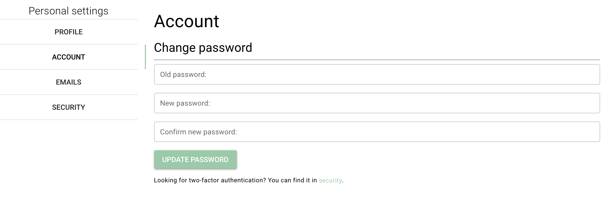

```{r, echo=FALSE}

```

# Routes

- databrary.org/my/settings/account
- nyu.databrary.org/my/settings/account
- databrary.org/my/account
- nyu.databrary.org/account

# From

- [settings](settings.html)
- [landingPageAuth](landingPageAuth.html)
- [landingPageNoAuth](landingPageNoAuth.html)

# To

- [profile](profile.html)
- [account](account.html)
- [emails](emails.html)
- [security](security.html)
