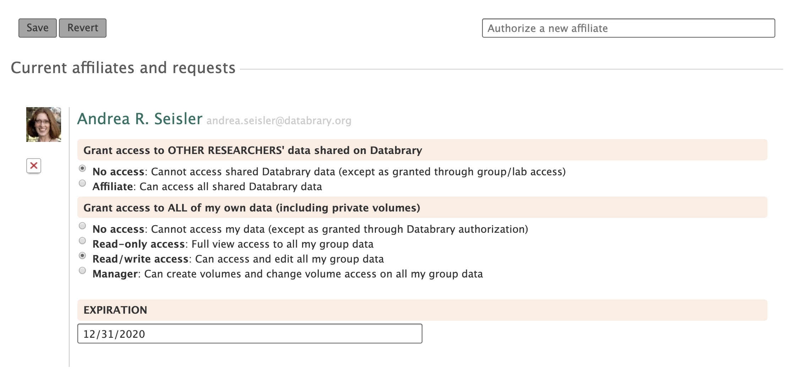

```{r echo=FALSE}

```

# Routes

- databrary.org/my/people
- nyu.databrary.org/my/people

# From

- [login](login.html)
- [databrary.org](index.html)
- [dashboard](landingPageAuth.html)
- [projects](myProjects.html)

# To

- [people](myPeople.html)
- [settings](settings.html)
- [profile](profile.html)
- [dashboard](landingPageAuth.html)

# Actions

- Agree to supervise Supervised Users
- Remove Supervised Users from supervision
- Unshare projects (with specific people)
- Share projects (with specific people)
- Get data about people
